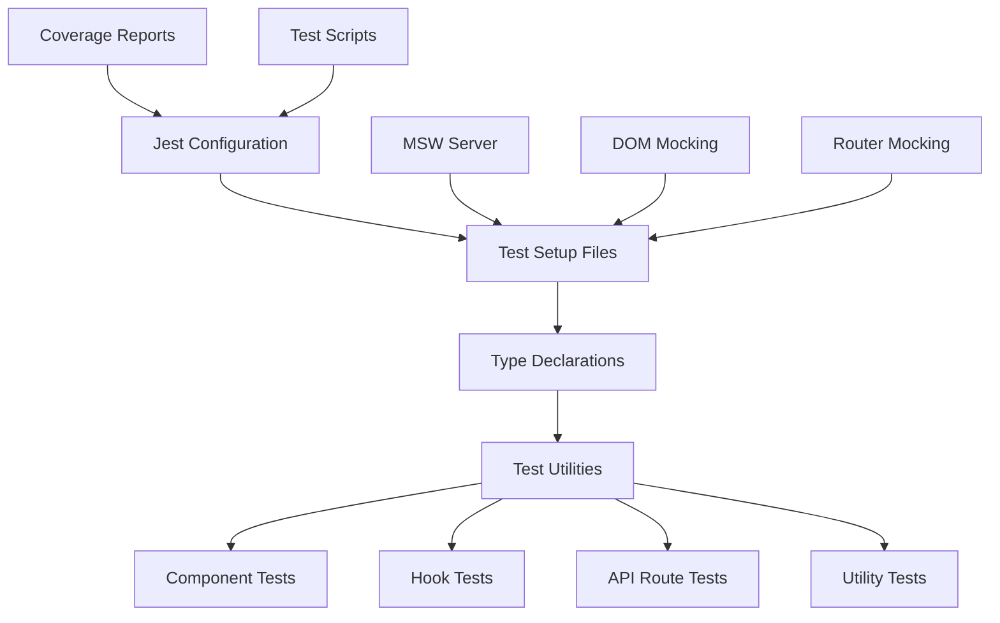

# Design Document

## Overview

This design addresses the 103 non-critical test errors in the Avalanche Console application by implementing comprehensive test infrastructure improvements. The solution focuses on enhancing Jest DOM setup, fixing test-specific issues, and establishing robust testing patterns that will prevent similar issues in the future.

The current application is production-ready with full functionality, but the test suite has configuration and implementation issues that need systematic resolution. The design ensures minimal disruption to existing functionality while maximizing test reliability and developer experience.

## Architecture

### Test Infrastructure Components



### Current Issues Analysis

Based on the test output and configuration review:

1. **Jest DOM Setup**: Already configured but may have TypeScript resolution issues
2. **Multiple Element Queries**: Tests using `getByText` instead of `getAllByText` for duplicate elements
3. **Component State Testing**: Tests expecting specific class names that may have changed
4. **API Route Testing**: NextResponse mocking challenges
5. **Hook Testing**: Async state management testing issues

## Components and Interfaces

### 1. Enhanced Jest Configuration

**File**: `jest.config.js`
- Maintain existing Next.js integration
- Add comprehensive module mapping
- Configure proper test environment setup
- Enhance coverage collection rules

### 2. Improved Test Setup

**File**: `jest.setup.js`
- Ensure Jest DOM matchers are properly loaded
- Add comprehensive DOM API mocking
- Configure MSW server with better error handling
- Add global test utilities

### 3. TypeScript Test Support

**File**: `types/jest-dom.d.ts`
- Extend existing Jest DOM type declarations
- Add custom matcher types
- Ensure proper module resolution

### 4. Test Utility Library

**New File**: `__tests__/utils/test-utils.tsx`
- Custom render function with providers
- Common test data factories
- Reusable test helpers
- Mock generators

### 5. Component Test Patterns

**Strategy**: Update existing component tests to:
- Use appropriate query methods (`getAllByText` vs `getByText`)
- Test behavior over implementation details
- Use semantic queries where possible
- Implement proper async testing patterns

### 6. API Route Test Framework

**Strategy**: Create standardized approach for:
- NextResponse mocking
- Request/Response testing
- Error scenario testing
- Authentication testing

## Data Models

### Test Configuration Schema

```typescript
interface TestConfig {
  setupFiles: string[]
  setupFilesAfterEnv: string[]
  testEnvironment: string
  moduleNameMapper: Record<string, string>
  collectCoverageFrom: string[]
  coverageThreshold: {
    global: {
      branches: number
      functions: number
      lines: number
      statements: number
    }
  }
}
```

### Test Utility Types

```typescript
interface CustomRenderOptions {
  preloadedState?: any
  store?: any
  wrapper?: React.ComponentType
}

interface MockApiResponse<T = any> {
  success: boolean
  data?: T
  error?: {
    message: string
    code?: string
  }
}

interface TestDataFactory<T> {
  create: (overrides?: Partial<T>) => T
  createMany: (count: number, overrides?: Partial<T>) => T[]
}
```

## Error Handling

### Test Error Categories

1. **Configuration Errors**
   - Missing type declarations
   - Incorrect module resolution
   - Setup file issues

2. **Query Errors**
   - Multiple element matches
   - Element not found
   - Timing issues

3. **Mocking Errors**
   - API response mocking
   - DOM API mocking
   - Module mocking

4. **Async Testing Errors**
   - Race conditions
   - Unresolved promises
   - State update warnings

### Error Resolution Strategy

```typescript
// Error boundary for test utilities
export const withErrorBoundary = (Component: React.ComponentType) => {
  return (props: any) => (
    <ErrorBoundary fallback={<div>Test Error</div>}>
      <Component {...props} />
    </ErrorBoundary>
  )
}

// Async test helper
export const waitForAsyncUpdates = async () => {
  await act(async () => {
    await new Promise(resolve => setTimeout(resolve, 0))
  })
}
```

## Testing Strategy

### 1. Component Testing Approach

- **Behavioral Testing**: Focus on user interactions and outcomes
- **Accessibility Testing**: Ensure proper ARIA attributes and semantic HTML
- **Visual Regression Prevention**: Test component structure without brittle class name assertions
- **State Management Testing**: Verify state changes through user actions

### 2. Hook Testing Framework

- **Isolated Testing**: Test hooks in isolation using `@testing-library/react-hooks`
- **Integration Testing**: Test hooks within component context
- **Async State Testing**: Proper handling of loading, success, and error states
- **Cleanup Testing**: Ensure proper cleanup on unmount

### 3. API Route Testing Standards

- **Request/Response Testing**: Verify proper HTTP handling
- **Authentication Testing**: Test protected routes
- **Error Scenario Testing**: Verify error responses
- **Data Validation Testing**: Test input validation

### 4. Utility Function Testing

- **Pure Function Testing**: Test utility functions in isolation
- **Edge Case Testing**: Cover boundary conditions
- **Type Safety Testing**: Ensure TypeScript compliance
- **Performance Testing**: Verify efficient implementations

## Implementation Phases

### Phase 1: Core Infrastructure
1. Update Jest configuration
2. Enhance test setup files
3. Fix TypeScript declarations
4. Create test utility library

### Phase 2: Component Test Fixes
1. Fix query selector issues
2. Update assertion patterns
3. Implement proper async testing
4. Add accessibility testing

### Phase 3: API and Hook Tests
1. Standardize API route testing
2. Fix hook testing patterns
3. Improve mock implementations
4. Add integration tests

### Phase 4: Quality Assurance
1. Run comprehensive test suite
2. Verify coverage reports
3. Update documentation
4. Establish testing guidelines

## Performance Considerations

- **Test Execution Speed**: Optimize test setup and teardown
- **Memory Usage**: Proper cleanup of mocks and DOM elements
- **Parallel Execution**: Ensure tests can run in parallel safely
- **CI/CD Integration**: Fast feedback loops for development

## Security Considerations

- **Mock Data**: Ensure test data doesn't contain sensitive information
- **API Mocking**: Secure mock implementations that don't expose real endpoints
- **Environment Isolation**: Proper separation of test and production environments